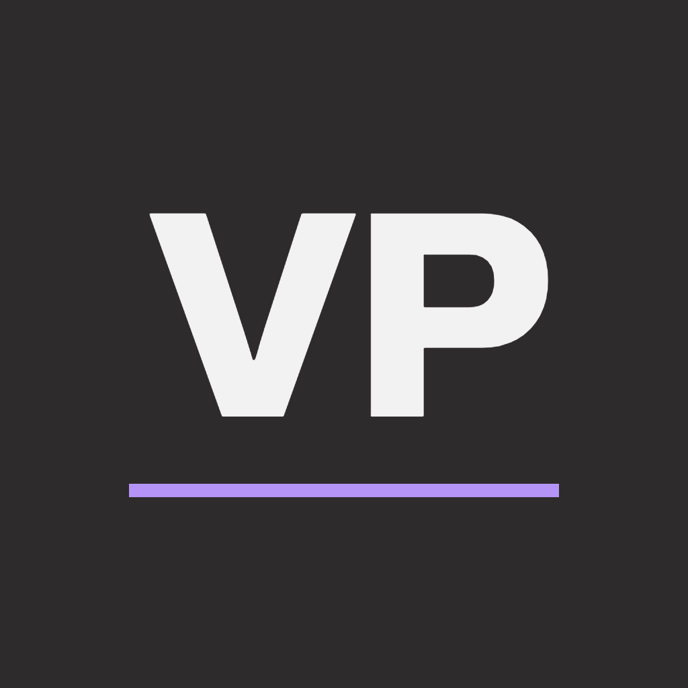
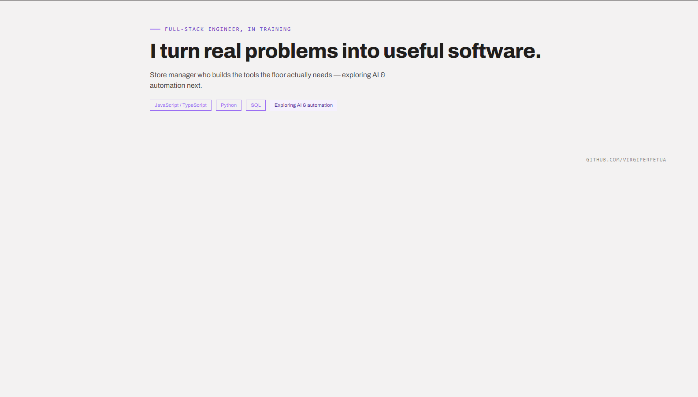

# Virginia Perpetua Assets

> **Primary:** GitHub. GitLab (`virginia-perpetua/design-system/*`) is a mirror.

**Site:** [https://assets.design.virgiperpetua.com](https://assets.design.virgiperpetua.com) (GitHub Pages from `dist/`).

Binary brand assets — wordmark, VP mark, portrait, banners, Open Graph / LinkedIn art, and page screenshots from the Claude Design portfolio.

Token values live in [`tokens`](https://github.com/virgiperpetua/tokens). Marketing pages live in [`marketing`](https://github.com/virgiperpetua/marketing). Brand rules: [BRAND.md](./BRAND.md). Design export specs: [docs/design-export/](./docs/design-export/).

## At a glance

Previews link into `src/` — the committed source tree. `dist/` is generated at build time and is not in the repo.

| Asset | Preview | Default download |
| ----- | ------- | ---------------- |
| **Dark mark** (512) | [](./src/logo/mark/dark/bg-none/512.png) | [512.png](./src/logo/mark/dark/bg-none/512.png) |
| **Light mark** (512) | [](./src/logo/mark/light/bg-none/512.png) | [512.png](./src/logo/mark/light/bg-none/512.png) |
| **Wordmark dark** | [](./src/logo/wordmark/dark/bg-none/640.png) | [640.png](./src/logo/wordmark/dark/bg-none/640.png) |
| **Portrait** | [](./src/photo/virginia-photo.png) | [virginia-photo.png](./src/photo/virginia-photo.png) |
| **LinkedIn / OG banner** | [](./src/og-image/linkedin-banner.png) | [linkedin-banner.png](./src/og-image/linkedin-banner.png) |

## Layout

```text
src/logo/{wordmark,mark}/{dark|light}/…   # masters + PNG sizes
src/photo/                                 # portrait
src/og-image/                              # social share art
src/banners/                               # campaign / LinkedIn composites
src/screenshots/pages/                     # full-page design captures
docs/design-export/                        # Markdown specs paired with screenshots
dist/                                      # generated publish tree (gitignored; built for Pages)
portfolio/                                 # Claude Design source (*.dc.html)
```

## CDN-style paths

When served from Pages (or a CDN), treat `dist/` as the site root:

```text
/logo/mark/{dark|light}/bg-none/{32|256|512}.png
/logo/wordmark/{dark|light}/bg-none/{640|1280}.png
/photo/virginia-photo.png
/og-image/linkedin-banner.png
/screenshots/pages/{home|about|projects|resume|contact|linkedin-banner|brand-system-spec}.png
```

## Portrait sizes

Master: `photo/virginia-photo.png` (1254²). Reuse these for apps and metadata:

| Use | Path |
| --- | --- |
| Favicon | `photo/favicon-16x16.png`, `photo/favicon-32x32.png` |
| Apple touch | `photo/apple-touch-icon.png` (180) |
| PWA / Android | `photo/android-chrome-192x192.png`, `photo/android-chrome-512x512.png` |
| Social avatar | `photo/og-avatar.jpg` (1200²) |
| Size ladder (PNG + WebP) | `photo/sizes/{32,48,64,96,128,180,192,256,512,1024}.{png,webp}` |
| Web manifest | `photo/site.webmanifest` |

CDN-style: `/photo/sizes/256.webp`, `/photo/apple-touch-icon.png`.

